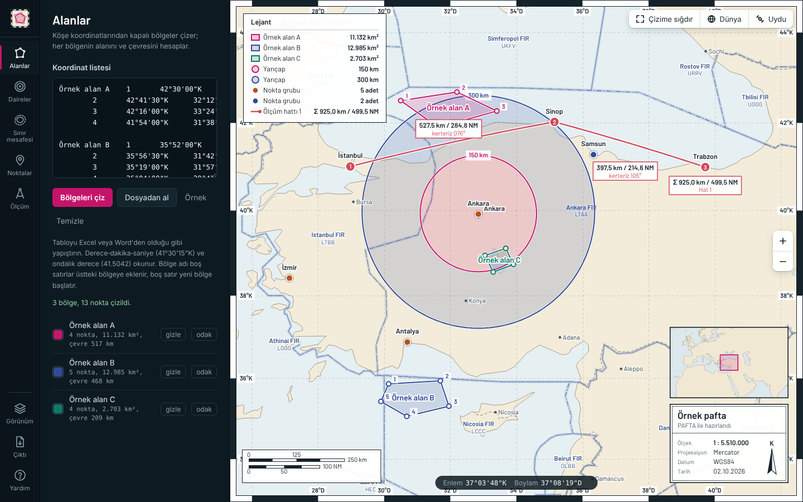
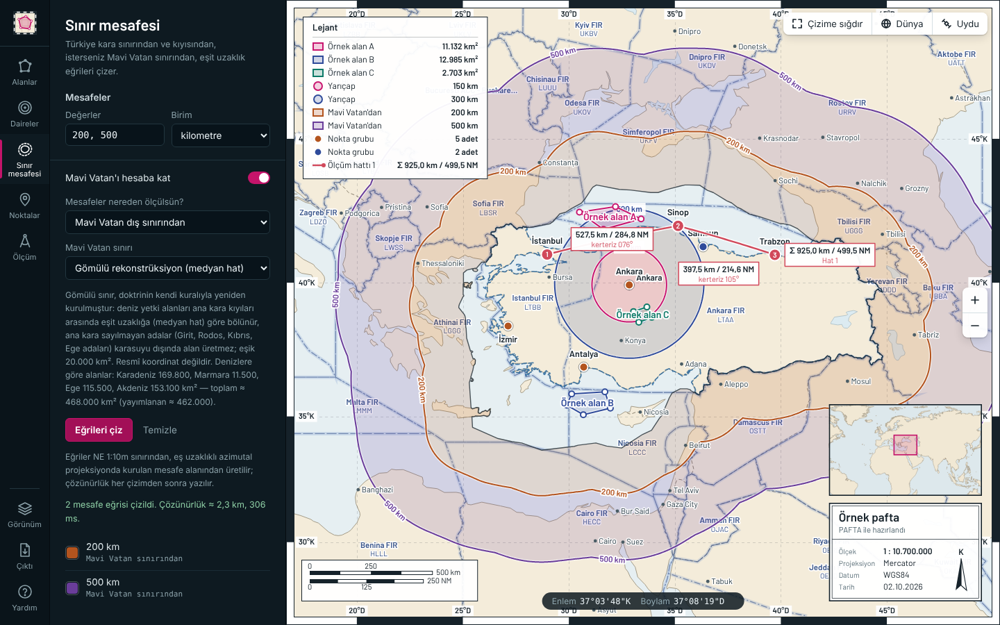
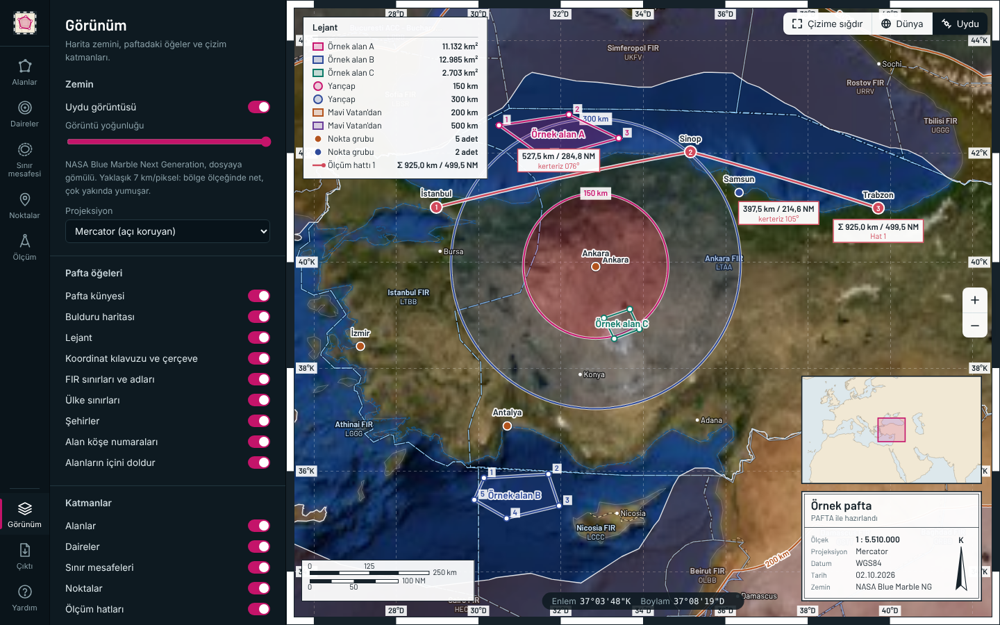
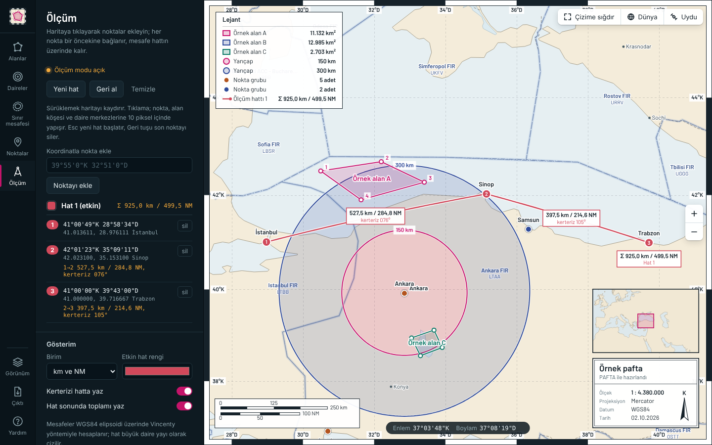
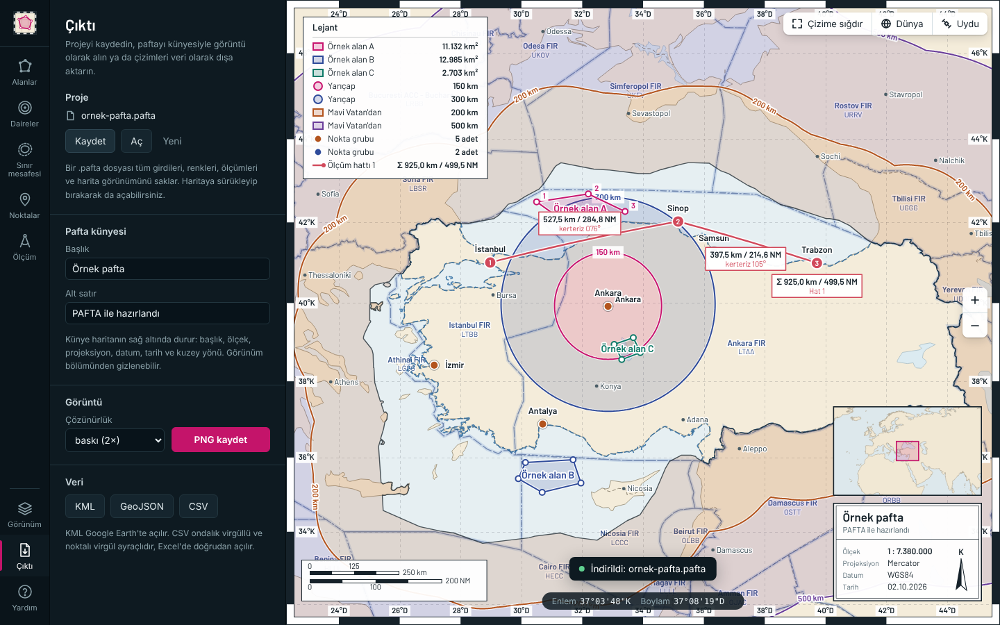
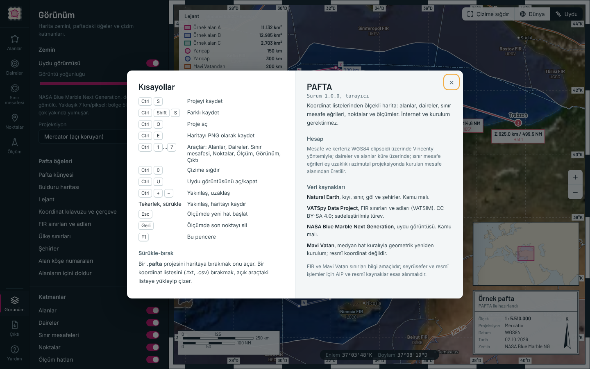
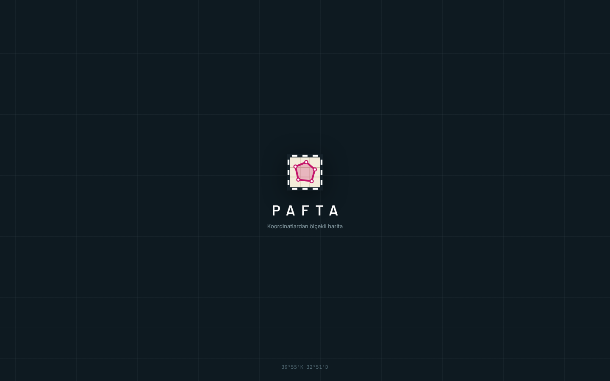

# PAFTA

Koordinat listelerinden **ölçekli harita** çizen, kurulum gerektirmeyen ve internetsiz çalışan bir araç.
Bölgeleri, yarıçap halkalarını, Türkiye sınırından ve Mavi Vatan'dan mesafe eğrilerini, isimli noktaları ve ölçümleri tek bir paftada gösterir; sonucu künyesiyle görüntü olarak ya da KML, GeoJSON ve CSV olarak verir.
Kapalı ağdaki, yönetici yetkisi olmayan bilgisayarlarda çalışmak üzere tasarlandı.

## Öne çıkanlar

- **Alanlar:** Excel veya Word'den yapıştırılan köşe koordinatlarından kapalı bölgeler. Her bölgenin alanı (km²) ve çevresi hesaplanır. Derece‑dakika‑saniye (`42°30'00"K`), boşluklu (`42 30 00 K`) ve ondalık (`42.5`) biçimler okunur.
- **Daireler:** Bir ya da birden fazla merkezden, istenen yarıçaplarda (km veya NM) gerçek sabit‑uzaklık halkaları. Her yarıçap kendi rengini alır.
- **Sınır mesafesi:** Türkiye kara sınırı ve kıyısından eşit uzaklık eğrileri. İsteğe bağlı olarak Mavi Vatan da hesaba katılır; mesafenin **Mavi Vatan dış sınırından** mı **Türkiye kara sınırından** mı ölçüleceği seçilir. Eğriler arası bantlar ayrı renklerle doldurulur.
- **Noktalar:** İsimli konumlar; beş işaret şekli, tek tek renk.
- **Ölçüm:** Haritaya tıklayarak noktalar ekleyin; her parçanın mesafesi (km / NM) ve kerterizi hatta yazılır, toplam hat sonunda gösterilir. Mesafeler WGS84 elipsoidi üzerinde Vincenty yöntemiyle hesaplanır.
- **Pafta öğeleri:** Dereceli çerçeve ve koordinat kılavuzu, km ve deniz milli çift ölçek çubuğu, lejant, **bulduru haritası** ve başlık, ölçek, projeksiyon, datum, tarih ve kuzey okunu taşıyan **pafta künyesi**.
- **Zemin:** Harita ya da **uydu görüntüsü** (NASA Blue Marble, dosyaya gömülü). Dünya geneli **FIR sınırları ve adları**, ülke sınırları, şehirler.
- **Proje dosyası (`.pafta`):** Tüm girdiler, renkler, ölçümler ve harita görünümü tek dosyada saklanır; haritaya sürükleyip bırakarak da açılır.
- **Çıktı:** PNG (ekran, 2× ve 3× çözünürlük), KML (Google Earth), GeoJSON, CSV.

## İndirme ve çalıştırma

İki sürüm vardır; ikisi de aynı uygulamadır ve aynı `.pafta` dosyalarını açar.

| Sürüm | Dosya | Nasıl çalışır |
|---|---|---|
| **Masaüstü (Windows)** | `PAFTA.exe` ([Releases](../../releases) sayfasından, ~11 MB) | Çift tıklayın. Kurulum ve yönetici yetkisi gerekmez. Kendi penceresinde açılır; dosyalar Windows'un aç/kaydet pencereleriyle açılıp kaydedilir. |
| **Tarayıcı** | [`app/pafta.html`](app/pafta.html) (~4 MB) | Dosyayı indirip Edge veya Chrome ile açın. İnternet gerekmez. |

> Exe sürümü ekranı göstermek için Windows'ta yerleşik gelen **Microsoft Edge WebView2** bileşenini kullanır (Windows 10/11'de normalde yüklüdür).
> Exe dijital imzalı değildir; kurum güvenlik politikası engellerse HTML sürümünü kullanın.

Masaüstü sürümüne özgü olanlar: son açılan paftalar listesi, `Ctrl+S` ile doğrudan aynı dosyaya kayıt, kaydedilmemiş değişiklikle kapatırken uyarı, beklenmedik kapanmaya karşı kurtarma kaydı, pencere boyutu ve konumunun hatırlanması, `.pafta` dosyasını exe'nin üzerine sürükleyerek açma.

## Hızlı başlangıç

1. Uygulamayı açın. Bir örnek görmek için [`ornekler/ornek-pafta.pafta`](ornekler/ornek-pafta.pafta) dosyasını haritaya sürükleyin ya da **Çıktı → Aç** deyin.
2. Soldaki şeritten bir araç seçin (**Alanlar**, **Daireler**, **Sınır mesafesi**, **Noktalar**, **Ölçüm**) ve koordinatlarınızı yapıştırın.
3. **Çıktı** bölümünden künyenin başlığını yazın; **PNG kaydet** ile paftayı görüntü olarak alın.
4. **Kaydet** (`Ctrl+S`) ile çalışmayı `.pafta` dosyası olarak saklayın.

Kısayolların tamamı uygulamada `F1` ile görünür. Ayrıntılı kullanım: **[docs/KULLANIM.md](docs/KULLANIM.md)**

## Ekran görüntüleri

| Sınır mesafesi ve Mavi Vatan | Uydu görüntüsü |
|---|---|
|  |  |

| Ölçüm | Proje ve çıktı |
|---|---|
|  |  |

| Kısayollar ve veri kaynakları | Açılış |
|---|---|
|  |  |

## Doğruluk ve sınırlar

- **Mesafe ve kerteriz:** WGS84 elipsoidi, Vincenty ters problemi (standart referans vakasında milimetre doğruluğu).
- **Daireler ve alan hesabı:** Küre üzerinde (R = 6371,0088 km).
- **Sınır mesafe eğrileri:** Eş uzaklıklı azimutal projeksiyonda kurulan sayısal mesafe alanından üretilir. Çizim sonrasında çözünürlük yazılır (tipik olarak 1–3 km); sapma 250 km'de ±2 km, 1000 km'de yaklaşık %1 mertebesindedir.
- **Kıyı ve sınırlar:** Natural Earth 1:50 milyon (taban harita) ve 1:10 milyon (Türkiye). Bölge ölçeğinde doğrudur; birkaç kilometreden yakında kıyı köşeli görünür.
- **Uydu görüntüsü:** ~7 km/piksel. Bölge ölçeğinde nettir, çok yakınlaşınca yumuşar.
- **FIR ve Mavi Vatan sınırları bilgi amaçlıdır.** Seyrüsefer ve resmî işlemler için AIP ve resmî kaynaklar esas alınmalıdır.

### Mavi Vatan sınırı hakkında

Açık erişimli resmî bir Mavi Vatan koordinat seti bulunmadığı için gömülü sınır, doktrinin kendi kuralıyla **geometrik olarak yeniden kurulmuştur**: deniz yetki alanları ana kara kıyıları arasında eşit uzaklığa (medyan hat) göre bölünür; ana kara sayılmayan adalar (Girit, Rodos, Kıbrıs, Ege adaları) karasuyu dışında alan üretmez. Ana kara eşiği 20.000 km²'dir.

| Deniz | Hesaplanan | Yayımlanan |
|---|---:|---:|
| Karadeniz | 169.824 km² | 172.000 km² |
| Marmara | 11.479 km² | 12.000 km² |
| Ege | 115.495 km² | 89.000 km² |
| Akdeniz | 153.117 km² | 189.000 km² |
| **Toplam** | **468.006 km²** | **≈ 462.000 km²** |

Ege ve Akdeniz arasındaki fark, iki denizi ayırmak için kullanılan 28,55°D sınırından kaynaklanır; ikisinin toplamı yayımlanan toplamla uyumludur. Resmî koordinatlarınız varsa uygulamada **Kendi koordinatlarım** seçeneğiyle onları kullanabilirsiniz.

## Veri kaynakları ve lisanslar

| Veri | Kaynak | Lisans |
|---|---|---|
| Kıyı, göller, ülke sınırları, şehirler, Türkiye sınırı | [Natural Earth](https://www.naturalearthdata.com) | Kamu malı |
| FIR sınırları ve adları | [VATSpy Data Project](https://github.com/vatsimnetwork/vatspy-data-project) (VATSIM) | [CC BY-SA 4.0](https://creativecommons.org/licenses/by-sa/4.0/) — `data/fir.json` sadeleştirilmiş bir türevdir ve aynı lisansla paylaşılır |
| Uydu görüntüsü | NASA Blue Marble Next Generation | Kamu malı |
| Mavi Vatan sınırı | Bu projede medyan hat kuralıyla üretildi (`tools/veri/mavi_vatan.py`) | — |

Ayrıntılar: [data/KAYNAKLAR.md](data/KAYNAKLAR.md)

## Geliştirme

Uygulama kaynakları `src/` klasöründedir; `python tools/build_html.py` veriyi gömerek `app/pafta.html` dosyasını üretir. Exe, aynı HTML'i bir Windows penceresinde gösteren küçük bir Go programıdır (`desktop/`).
Mimari, proje dosyası biçimi, verilerin yeniden üretilmesi ve derleme: **[docs/GELISTIRME.md](docs/GELISTIRME.md)**
